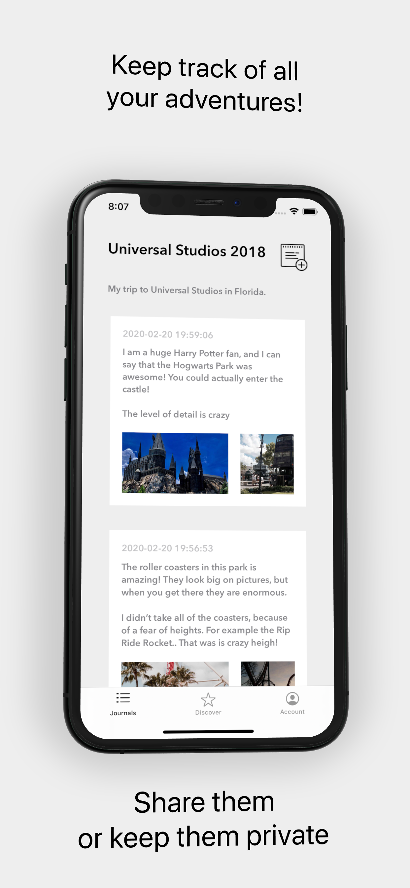
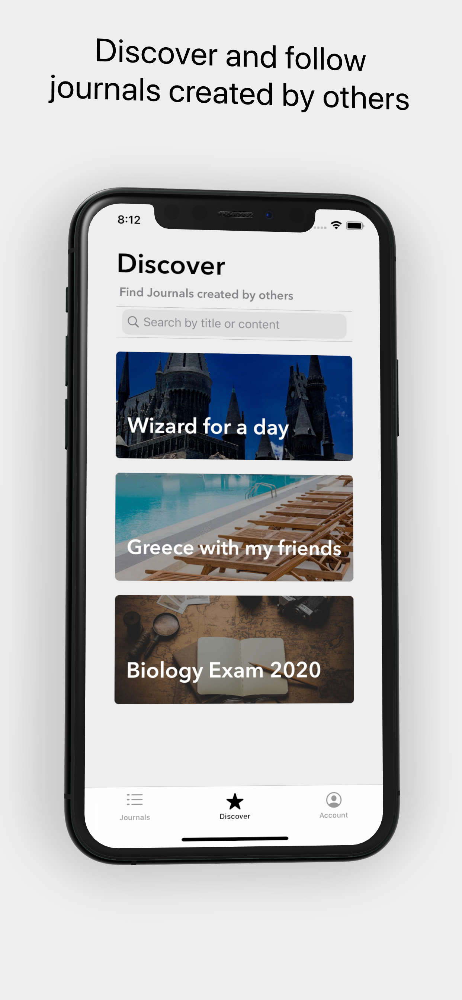
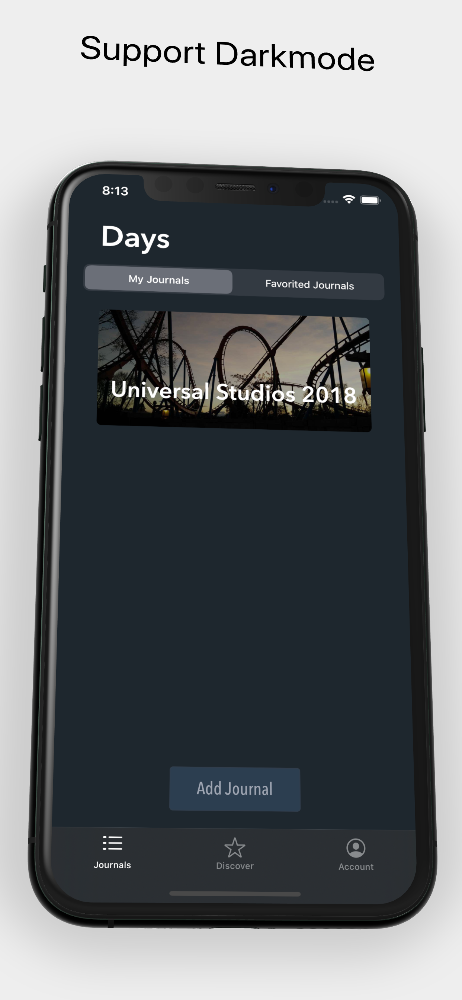

# Days

Lets the user create Journals for logging every experience in their life.
User can share their journals, or keep them private.

Connects to Firebase backend, using Firestore and Storage, as well as Authentication.

UI is created programmatically.
No storyboard.

# Posts Screen

# Discover screen

 

# Supports Darkmode

 
